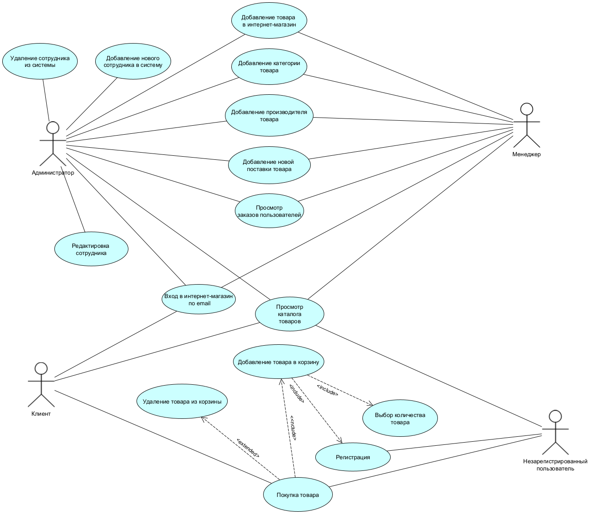
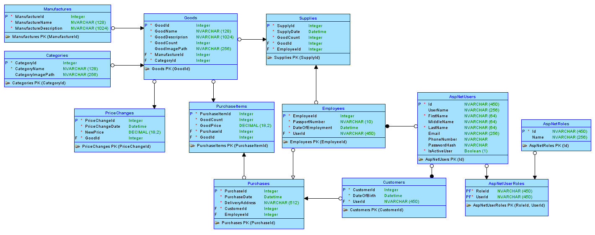
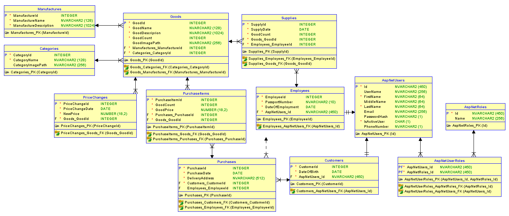
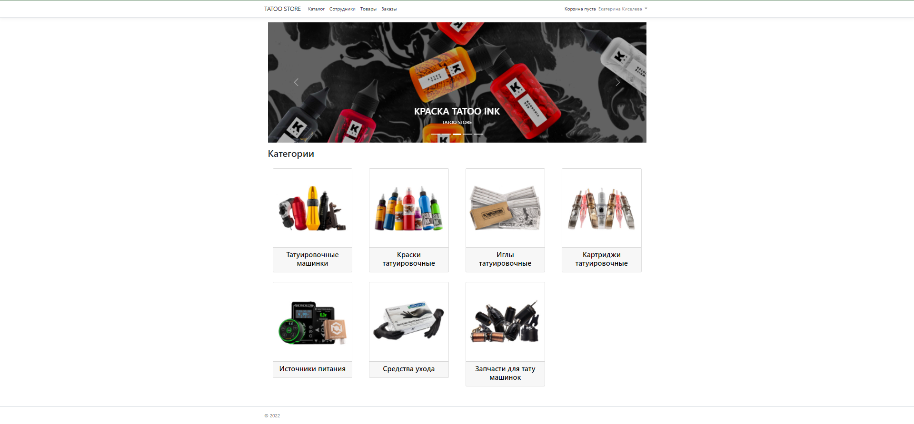
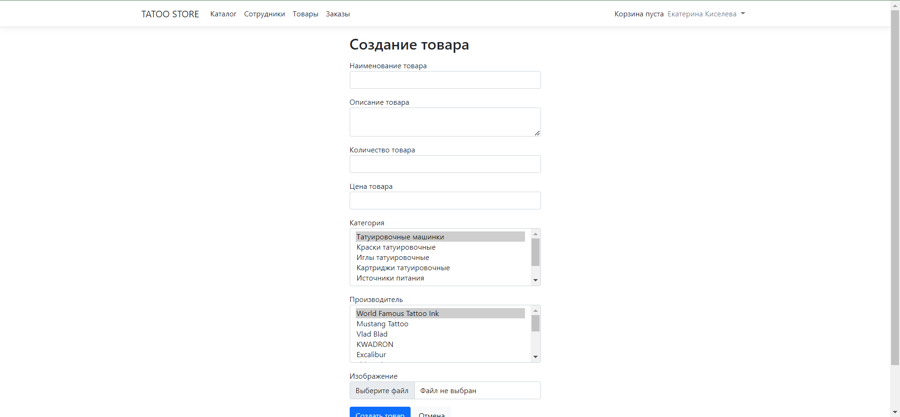
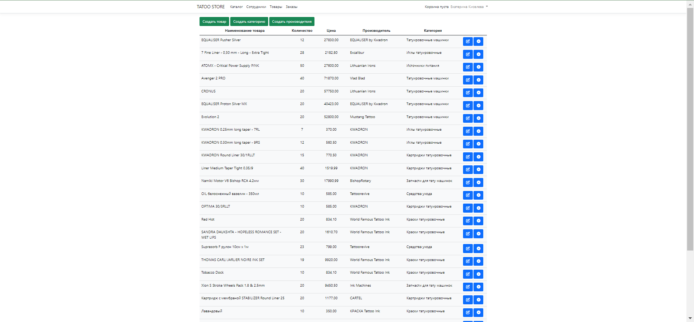
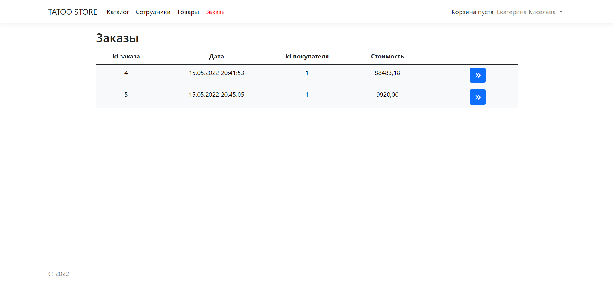
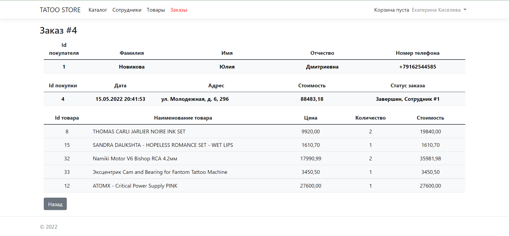
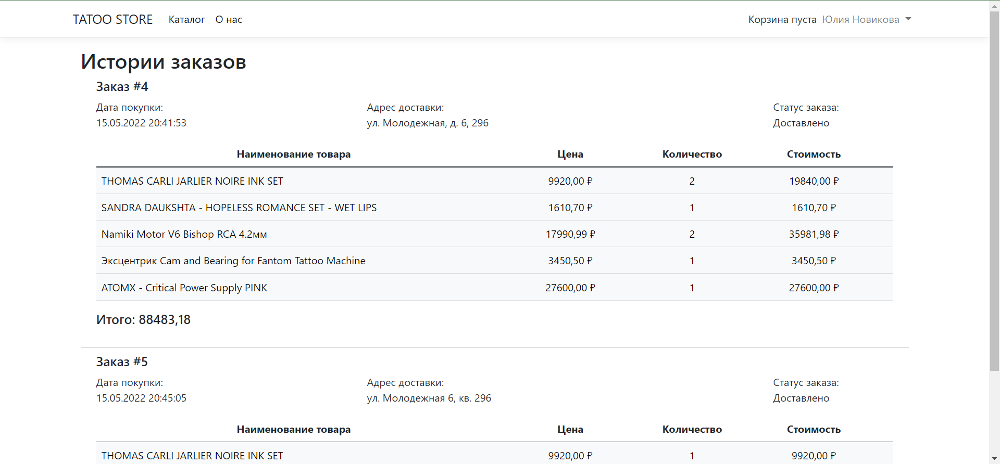
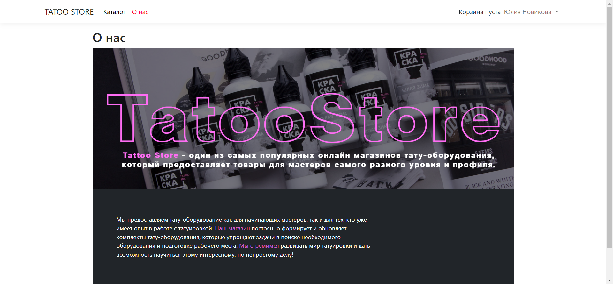

## Учебный проект "Информационная система для онлайн магазина тату оборудования"

### Стек технологий
- C#;
- Razor Pages в ASP.NET Core;
- ADO.NET Entity F++ramework (EF);
- Oracle SQL Developer Data Modeler;
- SQL Server Management Studio (SSMS);
- Microsoft Visual Studio;
- HTML, CSS, JavaScript, Ajax;
- Bootstrap.

### Диаграмма вариантов использования

### Модель базы даных

#### Логическая модель

#### Физическая модель

### Пользовательский интерфейс

#### Администратор/Менеджер

#### Клиент

